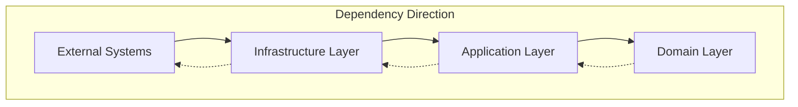
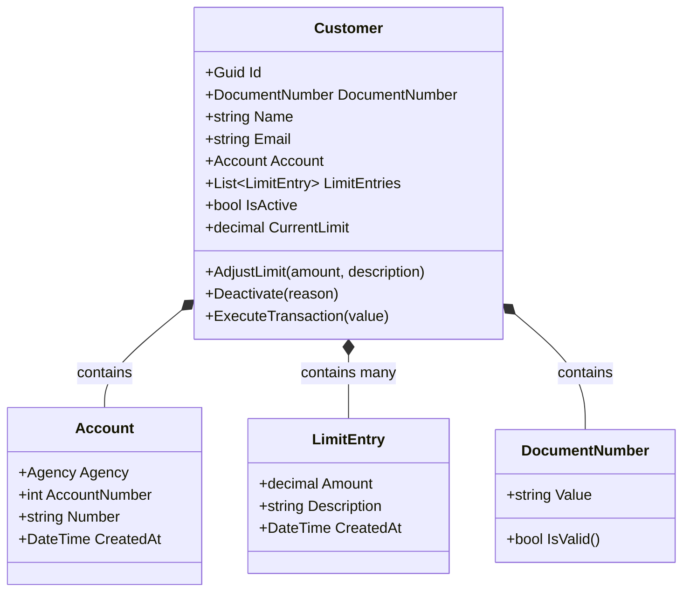
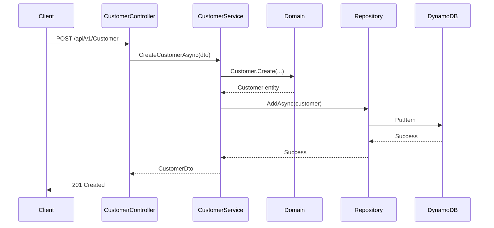
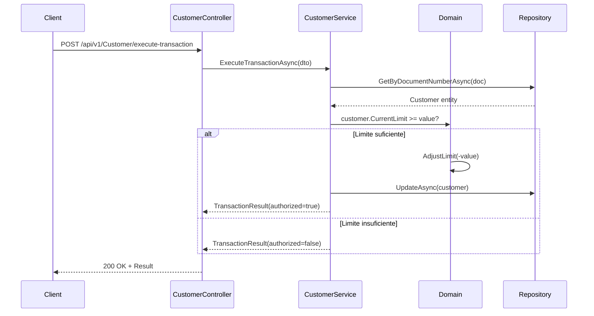
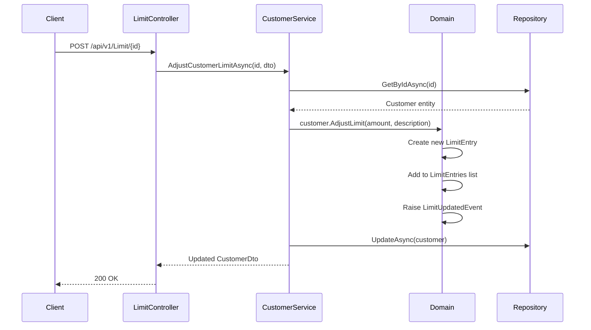

# 🏗️ Arquitetura do Sistema KRT Banking

## 📋 Índice

- [Visão Geral](#-visão-geral)
- [Princípios Arquiteturais](#-princípios-arquiteturais)
- [Camadas da Aplicação](#-camadas-da-aplicação)
- [Domain-Driven Design](#-domain-driven-design)
- [Padrões Implementados](#-padrões-implementados)
- [Estrutura de Dados](#-estrutura-de-dados)
- [Fluxo de Processamento](#-fluxo-de-processamento)
- [Decisões Técnicas](#-decisões-técnicas)

## 🎯 Visão Geral

O sistema KRT Banking foi desenvolvido seguindo os princípios de **Clean Architecture** e **Domain-Driven Design (DDD)**, garantindo:

- **Separação de Responsabilidades**: Cada camada tem uma responsabilidade bem definida
- **Independência de Frameworks**: A lógica de negócio não depende de tecnologias externas
- **Testabilidade**: Arquitetura que facilita testes unitários e de integração
- **Manutenibilidade**: Código organizado e fácil de evoluir

## 🏛️ Princípios Arquiteturais

### Clean Architecture



### Inversão de Dependência

- **Domain Layer**: Não depende de nenhuma outra camada
- **Application Layer**: Depende apenas do Domain
- **Infrastructure Layer**: Implementa interfaces definidas nas camadas superiores
- **API Layer**: Orquestra as operações e gerencia HTTP

## 🔄 Camadas da Aplicação

### 1. **Presentation Layer** (KRTBanking.API)

**Responsabilidade**: Interface HTTP e orquestração de requests

```
Controllers/
├── CustomerController.cs    # Operações CRUD de clientes
└── LimitController.cs       # Gestão de limites

DTOs/                        # Transferência de dados HTTP
Configuration/               # Configurações da API
Middleware/                  # Interceptadores HTTP
```

**Características**:
- ✅ Controllers com versionamento de API
- ✅ Validação de entrada via Data Annotations
- ✅ Mapeamento automático de erros para HTTP Status
- ✅ Documentação automática com Swagger/OpenAPI
- ✅ Health Checks integrados

### 2. **Application Layer** (KRTBanking.Application)

**Responsabilidade**: Casos de uso e orquestração de operações de negócio

```
Services/
├── CustomerService.cs       # Orquestração de operações de cliente
└── ICustomerService.cs      # Interface do serviço

DTOs/
├── Customer/               # DTOs de cliente
└── Transaction/            # DTOs de transação

Extensions/
└── ServiceCollectionExtensions.cs  # Configuração DI
```

**Características**:
- ✅ Services que implementam casos de uso
- ✅ DTOs para transferência de dados entre camadas
- ✅ Mapeamento entre Domain Objects e DTOs
- ✅ Validação de regras de negócio
- ✅ Logging estruturado

### 3. **Domain Layer** (KRTBanking.Domain)

**Responsabilidade**: Lógica de negócio pura e regras do domínio

```
Context/Customer/
├── Entities/
│   └── Customer.cs          # Raiz do agregado
├── ValueObjects/
│   ├── Account.cs           # Dados da conta
│   ├── DocumentNumber.cs    # CPF
│   ├── LimitEntry.cs        # Entrada de limite
│   └── Agency.cs            # Enum de agências
├── Events/
│   ├── CustomerCreatedDomainEvent.cs
│   ├── CustomerLimitUpdatedDomainEvent.cs
│   └── CustomerDeactivatedDomainEvent.cs
└── Repositories/
    └── ICustomerRepository.cs

Abstractions/
├── IAggregateRoot.cs        # Interface para agregados
├── IEntity.cs               # Interface para entidades
└── IDomainEvent.cs          # Interface para eventos
```

**Características**:
- ✅ **Rich Domain Model**: Entidades com comportamento
- ✅ **Value Objects**: Objetos imutáveis para representar valores
- ✅ **Domain Events**: Comunicação entre agregados
- ✅ **Repository Pattern**: Abstração para persistência
- ✅ **Aggregate Root**: Controle de consistência transacional

### 4. **Infrastructure Layer** (KRTBanking.Infrastructure)

**Responsabilidade**: Implementação de persistência e integrações externas

```
Data/
├── Context/
│   └── DynamoDbContext.cs   # Contexto do DynamoDB
├── Models/
│   ├── CustomerDynamoDbModel.cs
│   ├── CustomerDynamoModel.cs
│   ├── AccountModel.cs
│   └── LimitEntryModel.cs
├── Mappers/
│   └── CustomerMapper.cs    # Mapeamento Domain ↔ Data
└── Repositories/
    ├── CustomerRepository.cs
    └── CustomerDynamoRepository.cs

HealthChecks/
└── DynamoDbHealthCheck.cs   # Verificação de saúde do DynamoDB

Extensions/
└── ServiceCollectionExtensions.cs
```

**Características**:
- ✅ **DynamoDB**: Banco NoSQL para alta performance
- ✅ **Dual Repository**: Implementações para diferentes modelos
- ✅ **Data Mappers**: Conversão entre domain e persistence models
- ✅ **Health Checks**: Monitoramento de dependências
- ✅ **Connection Pooling**: Otimização de conexões

## 🎯 Domain-Driven Design

### Bounded Context: Customer Management



### Agregados e Consistência

- **Customer**: Agregado raiz que garante consistência
- **Account**: Value Object imutável
- **LimitEntry**: Value Object para histórico de alterações
- **DocumentNumber**: Value Object com validação de CPF/CNPJ

### Eventos de Domínio

```csharp
// Eventos disparados automaticamente
CustomerCreatedDomainEvent       // Quando cliente é criado
CustomerLimitUpdatedDomainEvent  // Quando limite é alterado
CustomerDeactivatedDomainEvent   // Quando cliente é desativado
```

## 🔧 Padrões Implementados

### 1. Repository Pattern
```csharp
public interface ICustomerRepository
{
    Task<Customer?> GetByIdAsync(Guid id, CancellationToken cancellationToken);
    Task<Customer?> GetByDocumentNumberAsync(string documentNumber, CancellationToken cancellationToken);
    Task AddAsync(Customer customer, CancellationToken cancellationToken);
    Task UpdateAsync(Customer customer, CancellationToken cancellationToken);
}
```

### 2. CQRS (Command Query Responsibility Segregation)
- **Commands**: Operações que alteram estado (Create, Update, Delete)
- **Queries**: Operações de consulta (GetById, GetAll)

### 3. Unit of Work
- Transações controladas no nível de agregado
- Consistência garantida por agregado raiz

### 4. Factory Pattern
```csharp
// Criação de entidades complexas
Customer.Create(documentNumber, name, email, account, limitAmount, description);
Account.Create(agency, accountNumber);
LimitEntry.Create(amount, description);
```

### 5. Specification Pattern (Implícito)
- Validações encapsuladas nos Value Objects
- Regras de negócio centralizadas nas entidades

## 💾 Estrutura de Dados

### DynamoDB Schema

#### Tabela: KRTBanking-Customers

```json
{
  "PK": "CUSTOMER#123e4567-e89b-12d3-a456-426614174000",
  "SK": "CUSTOMER",
  "CustomerId": "123e4567-e89b-12d3-a456-426614174000",
  "DocumentNumber": "12345678901",
  "Name": "João Silva Santos",
  "Email": "joao@email.com",
  "Account": "{\"number\":\"0001-00123456\",\"createdAt\":\"2024-01-01T00:00:00Z\"}",
  "Limits": "[{\"amount\":5000.00,\"description\":\"Limite inicial\",\"createdAt\":\"2024-01-01T00:00:00Z\"}]",
  "IsActive": true,
  "CreatedAt": "2024-01-01T00:00:00Z",
  "UpdatedAt": "2024-01-01T00:00:00Z",
  "Version": 1,
  "GSI1PK": "DOC#12345678901",
  "GSI1SK": "CUSTOMER"
}
```

#### Índices

- **Primary Key**: PK (Customer ID) + SK (Type)
- **GSI1**: GSI1PK (Document Number) + GSI1SK (Type)
  - Permite busca eficiente por documento

### Estratégias de Acesso

1. **GetById**: Busca direta por PK
2. **GetByDocument**: Busca via GSI1
3. **GetAll**: Scan com paginação
4. **Health Check**: Query de verificação

## 🔄 Fluxo de Processamento

### 1. Cadastro de Cliente



### 2. Processamento de Transação PIX



### 3. Ajuste de Limite



## 🛡️ Decisões Técnicas

### 1. **Soft Delete vs Hard Delete**

**Escolhido**: Soft Delete
- ✅ **Compliance**: Manutenção de histórico para auditoria
- ✅ **Recuperação**: Possibilidade de restaurar dados
- ✅ **Análise**: Dados disponíveis para análise posterior

### 2. **Value Objects para Dados Críticos**

**Implementado**:
- `DocumentNumber`: Validação de CPF/CNPJ
- `Account`: Imutabilidade de dados bancários
- `LimitEntry`: Histórico imutável de alterações

### 3. **Event-Driven Architecture**

**Domain Events**:
- ✅ **Desacoplamento**: Agregados se comunicam via eventos
- ✅ **Auditoria**: Rastreamento automático de mudanças
- ✅ **Extensibilidade**: Novos handlers sem alterar código existente
---
**Esta arquitetura garante um sistema robusto, escalável e manutenivel para as necessidades do Banco KRT**

--- 

**Desenvolvido com ❤️ por giomartinsdev :D**
